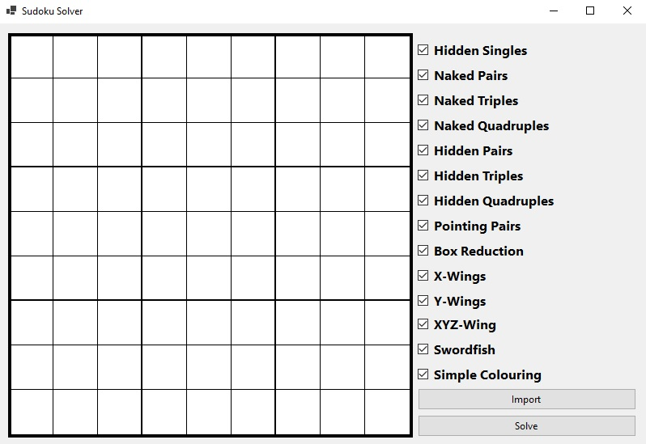
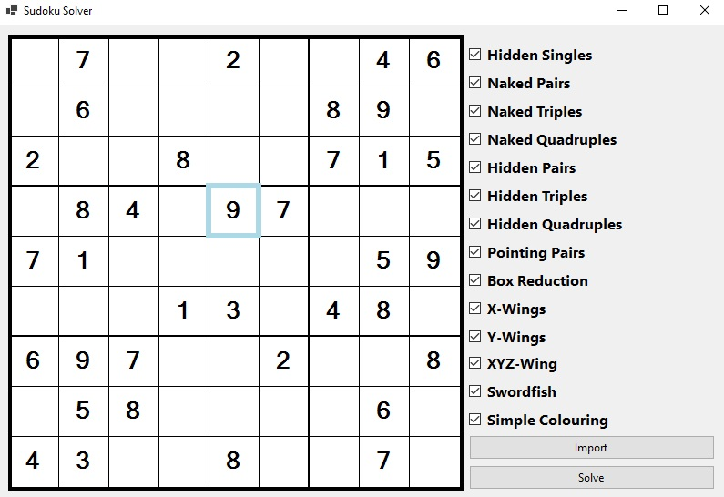
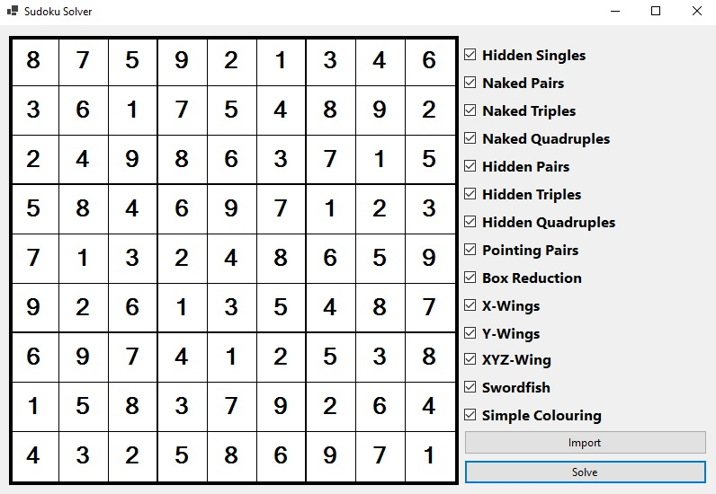
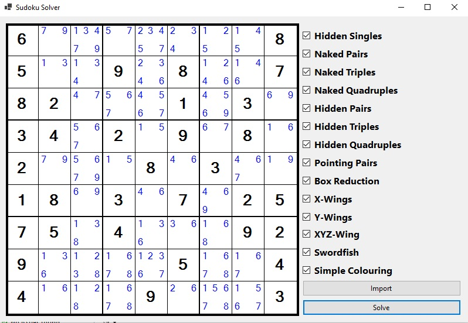

<div id="top"></div>
<!--
*** Thanks for checking out the Best-README-Template. If you have a suggestion
*** that would make this better, please fork the repo and create a pull request
*** or simply open an issue with the tag "enhancement".
*** Don't forget to give the project a star!
*** Thanks again! Now go create something AMAZING! :D
-->


<!-- PROJECT SHIELDS -->
<!--
*** I'm using markdown "reference style" links for readability.
*** Reference links are enclosed in brackets [ ] instead of parentheses ( ).
*** See the bottom of this document for the declaration of the reference variables
*** for contributors-url, forks-url, etc. This is an optional, concise syntax you may use.
*** https://www.markdownguide.org/basic-syntax/#reference-style-links
-->
[![Contributors][contributors-shield]][contributors-url]
[![Forks][forks-shield]][forks-url]
[![Stargazers][stars-shield]][stars-url]
[![MIT License][license-shield]][license-url]


<!-- PROJECT LOGO -->
<br />
<div align="center">

<h3 align="center">Sudoku Solver</h3>

  <p align="center">
    <br />
    <br />
    <a href="https://github.com/TheCodingDamian/flashcards/issues">Report Bug</a>
    ·
    <a href="https://github.com/TheCodingDamian/flashcards/issues">Request Feature</a>
  </p>
</div>


<!-- TABLE OF CONTENTS -->
<details>
  <summary>Table of Contents</summary>
  <ol>
    <li>
      <a href="#about-the-project">About The Project</a>
      <ul>
        <li><a href="#built-with">Built With</a></li>
      </ul>
    </li>
    <li>
      <a href="#getting-started">Getting Started</a>
      <ul>
        <li><a href="#prerequisites">Prerequisites</a></li>
        <li><a href="#installation">Installation</a></li>
      </ul>
    </li>
    <li><a href="#usage">Usage</a></li>
    <li><a href="#license">License</a></li>
    <li><a href="#acknowledgments">Acknowledgments</a></li>
  </ol>
</details>


<!-- ABOUT THE PROJECT -->
## About The Project

This is an implementation of some of the most widely required advanced sudoku solving techniques, such as X-Wings, Swordfish and others in C#. The project comes with a GUI that allows
the import and manual input of soduoku puzzles and allows the user to specify which solving techniques may be used.

<p align="right">(<a href="#top">back to top</a>)</p>


### Built With

* Microsoft .NET Framework 5.0

<p align="right">(<a href="#top">back to top</a>)</p>


<!-- GETTING STARTED -->
## Getting Started

To get a local copy up and running follow these simple example steps.

### Prerequisites

This project requires the installation of the .NET runtime environment. It can be downloaded from Microsoft's official website.

### Installation

1. Clone the repository
   ```sh
   git clone https://github.com/TheCodingDamian/SudokuSolver.git
   ```
2. Run the pre-compiled binary from the path `bin/SudokuSolver.exe`
  OR
  Build the project yourself by opening it using Visual Studio.


<!-- USAGE EXAMPLES -->
## Usage


After running the app, the GUI will be displayed.

<div style="text-align: center">

</div>

You can now use the GUI to manually edit the sudoku puzzle. Alternatively, you can press the "Import" button to import an existing sudoku puzzle from a file.
THe format is a simple `txt` file consisting of nine lines with nine characters each, where each character is either a digit from one to nine, or an empty space if the puzzle is empty at that position.



Once you have provided your sudoku puzzle to the solver, you can press the "Solve" button to run the solving procedure. After a short processing time, the resulting solution
will be displayed. Should the solver determine the puzzle as unsolvable (i.e. no solution for this sudoku exists), a message window will pop up reporting the result. Should the solver
be unable to find a solution, but also unable to prove that no solution exists, it will fill remaining spaces in the grid with pencil marks detailing all digits that may still be entered in each cell.




You may also modify the allowed sudoku techniques that the solver may use to solve the puzzle. You can simply do this by un-checking any of the techniques on the right before pressing "Solve".

<p align="right">(<a href="#top">back to top</a>)</p>


<!-- LICENSE -->
## License

Distributed under the MIT License. See `LICENSE.txt` for more information.

<p align="right">(<a href="#top">back to top</a>)</p>


<!-- ACKNOWLEDGMENTS -->
## Acknowledgments

* Thank you to [Best-README-Template](https://github.com/othneildrew/Best-README-Template) for the README template

<p align="right">(<a href="#top">back to top</a>)</p>


<!-- MARKDOWN LINKS & IMAGES -->
<!-- https://www.markdownguide.org/basic-syntax/#reference-style-links -->
[contributors-shield]: https://img.shields.io/github/contributors/TheCodingDamian/flashcards.svg?style=for-the-badge
[contributors-url]: https://github.com/TheCodingDamian/flashcards/graphs/contributors
[forks-shield]: https://img.shields.io/github/forks/TheCodingDamian/flashcards.svg?style=for-the-badge
[forks-url]: https://github.com/TheCodingDamian/flashcards/network/members
[stars-shield]: https://img.shields.io/github/stars/TheCodingDamian/flashcards.svg?style=for-the-badge
[stars-url]: https://github.com/TheCodingDamian/flashcards/stargazers
[issues-shield]: https://img.shields.io/github/issues/TheCodingDamian/flashcards.svg?style=for-the-badge
[issues-url]: https://github.com/TheCodingDamian/flashcards/issues
[license-shield]: https://img.shields.io/github/license/TheCodingDamian/flashcards.svg?style=for-the-badge
[license-url]: LICENSE.txt
